# Data Flow Diagram (DFD)

## Context Diagram (DFD Level 0)
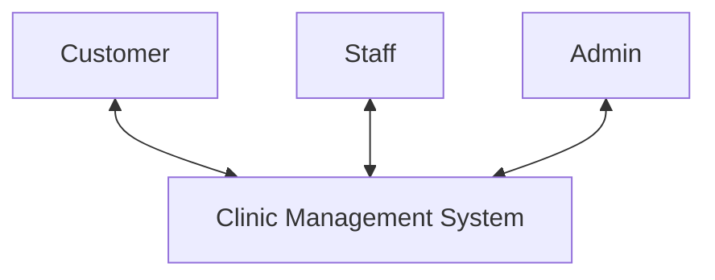

## Level 1 DFD

Each item below represents a main process in DFD Level 1. More detailed sub-processes and their specific interactions with Data Stores will be described in DFD Level 2.

### 1. User Management (Process 1.0)
This process handles all activities related to user accounts (Customer, Staff, Admin) such as registration, login, personal information management, and authorization.

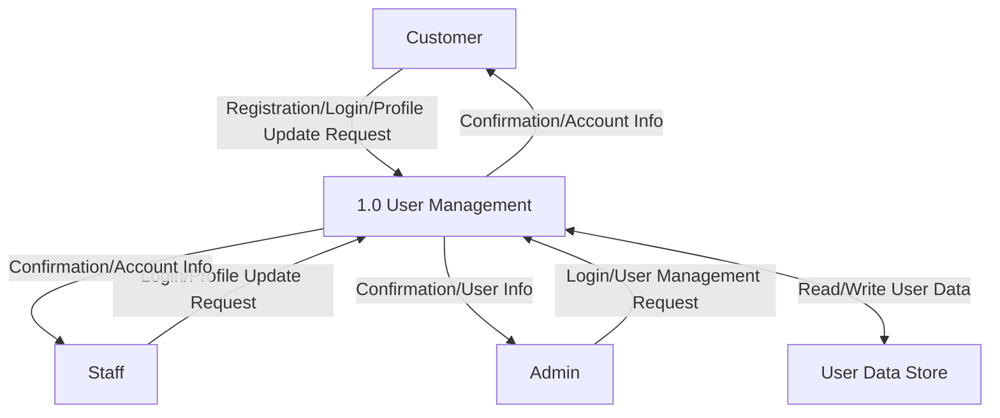

### 2. Product Management (Medicines and Scientific Machines) (Process 2.0)
This process includes displaying product information to Customers and allowing Staff/Admin to manage categories and detailed information of medicines and scientific machines.

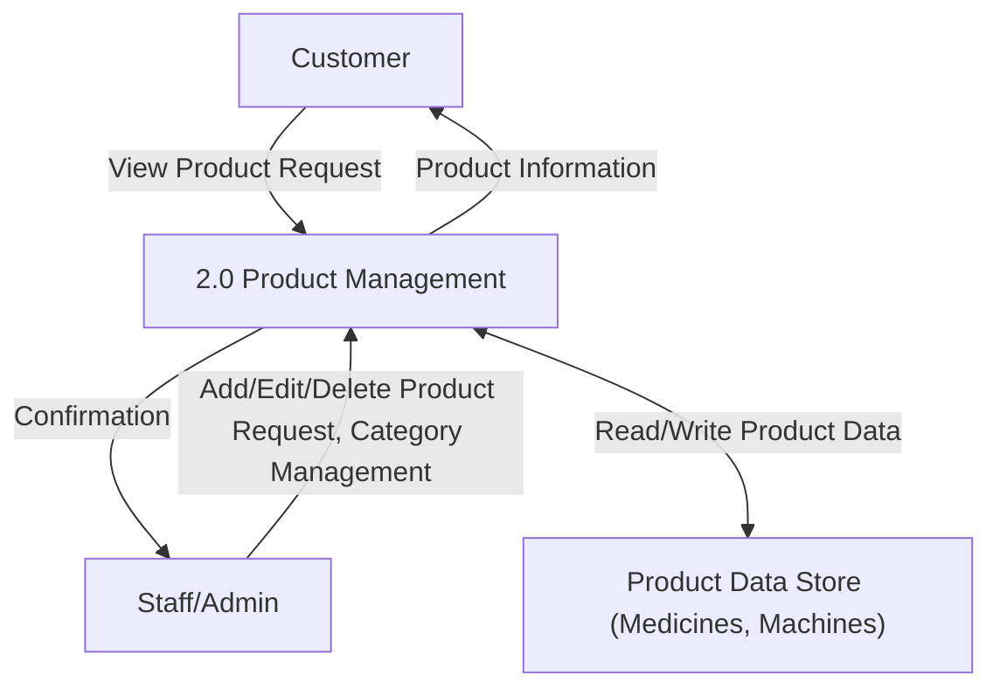

### 3. Online Purchase Management (Process 3.0)
This process handles the entire purchasing process from Customer browsing, selecting products, placing orders, payment processing, to Staff/Admin processing the order.

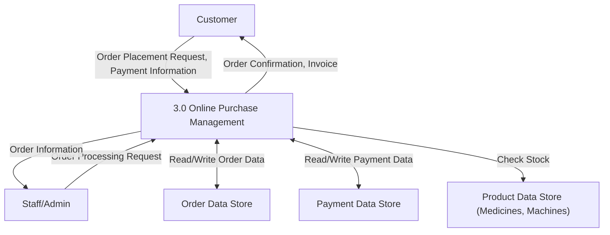

### 4. Educational Activity Management (Process 4.0)
This process allows Customers to view and register for educational activities. Staff (Lecturers) can create and update content and schedules. Admin manages these activities overall.

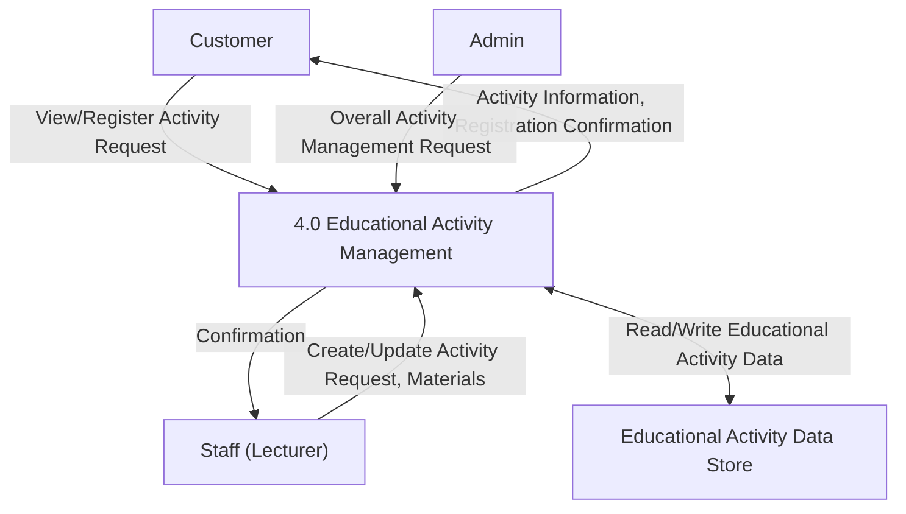

### 5. Website Content Management (Process 5.0)
This process allows Admin to update static website content such as the homepage, about us, and contact information. The system will display this content to Customers.

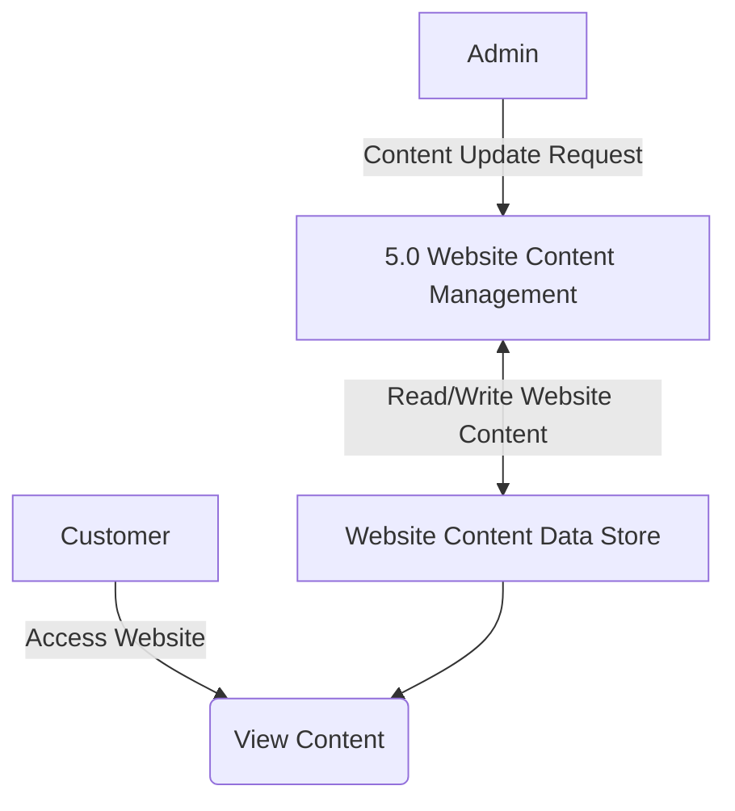
*(Note: Customer viewing content is often an implicit query. DFDs focus on data flows initiated by users or explicitly processed by the system. Here, Admin updates the Data Store, and Customers will read from it via page requests.)*

### 6. Customer Feedback Management (Process 6.0)
This process allows Customers to submit feedback on products and services. Staff or Admin can view and process this feedback.

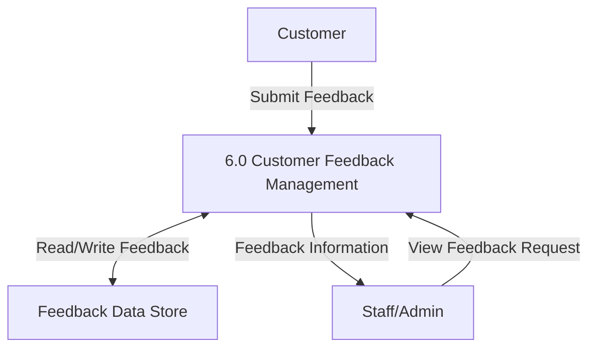

### 7. Report Generation (Process 7.0)
This process allows Admin or Staff to request and view summary reports on business performance and educational activity effectiveness, based on data from relevant Data Stores.

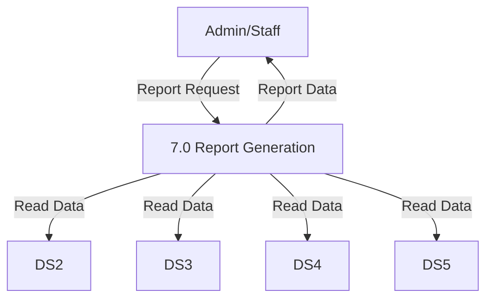

## Level 2 DFD

### 1.1 User Management - Admin User Management (Process 1.1)

This diagram shows how Admin manages user accounts with full administrative privileges including creating, modifying, and managing all user types.

```mermaid
graph TD
    Admin[Admin] -->|Create User Account Request| P1_1["1.1 Create User Account"]
    Admin -->|Edit User Profile Request| P1_2["1.2 Edit User Profile"]
    Admin -->|Delete User Account Request| P1_3["1.3 Delete User Account"]
    Admin -->|View All Users Request| P1_4["1.4 View All Users"]
    Admin -->|Search Users Request| P1_5["1.5 Search Users"]
    Admin -->|Manage User Roles Request| P1_6["1.6 Manage User Roles"]
    Admin -->|Reset User Password Request| P1_7["1.7 Reset User Password"]
    Admin -->|Generate User Reports Request| P1_8["1.8 Generate User Reports"]
    Admin -->|Bulk User Operations Request| P1_9["1.9 Bulk User Operations"]
    
    P1_1 -->|User Created Confirmation| Admin
    P1_2 -->|Profile Updated Confirmation| Admin
    P1_3 -->|User Deleted Confirmation| Admin
    P1_4 -->|All Users List| Admin
    P1_5 -->|User Search Results| Admin
    P1_6 -->|Role Management Confirmation| Admin
    P1_7 -->|Password Reset Confirmation| Admin
    P1_8 -->|User Analytics Report| Admin
    P1_9 -->|Bulk Operation Status| Admin
    
    P1_1 -->|Write New User Data| DS1["User Data Store"]
    P1_2 <-->|Read/Write User Data| DS1
    P1_3 -->|Delete User Data| DS1
    P1_4 -->|Read User Data| DS1
    P1_5 -->|Read User Data| DS1
    P1_6 <-->|Read/Write User Role Data| DS1
    P1_7 <-->|Read/Write Password Data| DS1
    P1_8 -->|Read User Data| DS1
    P1_9 <-->|Read/Write User Data| DS1
```

**Process Descriptions:**

- **1.1 Create User Account**: Admin can create new user accounts for Staff, Customer, or other Admin with complete access to all fields and permissions.
- **1.2 Edit User Profile**: Admin can modify any user's profile information including personal details, contact information, and account settings.
- **1.3 Delete User Account**: Admin can remove user accounts with override capabilities and data cleanup options.
- **1.4 View All Users**: Admin can access comprehensive user lists with advanced filtering by role, status, registration date, and activity.
- **1.5 Search Users**: Admin can perform advanced searches across all user data with administrative filters.
- **1.6 Manage User Roles**: Admin can assign, modify, or remove user roles and permissions for system access control.
- **1.7 Reset User Password**: Admin can reset passwords for any user account and manage password policies.
- **1.8 Generate User Reports**: Admin can generate detailed reports on user activity, registration trends, and system usage.
- **1.9 Bulk User Operations**: Admin can perform bulk operations like importing users, mass updates, or batch deletions.

### 1.2 User Management - Staff User Management (Process 1.2)

This diagram shows how Staff manages limited user account functions, primarily for customer support and basic user assistance.

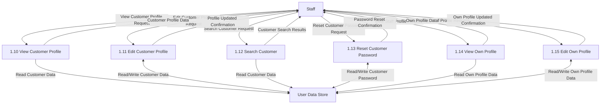

**Process Descriptions:**

- **1.10 View Customer Profile**: Staff can view customer profile information for support purposes with limited access to sensitive data.
- **1.11 Edit Customer Profile**: Staff can modify customer profile information with restricted permissions (basic contact details only).
- **1.12 Search Customer**: Staff can search for customer accounts to provide support using basic search criteria.
- **1.13 Reset Customer Password**: Staff can assist customers with password resets following security protocols.
- **1.14 View Own Profile**: Staff can view their own profile information and account settings.
- **1.15 Edit Own Profile**: Staff can update their own profile information including contact details and preferences.

### 1.3 User Management - Customer Self-Management (Process 1.3)

This diagram shows how Customers manage their own accounts including registration, profile updates, and account settings.

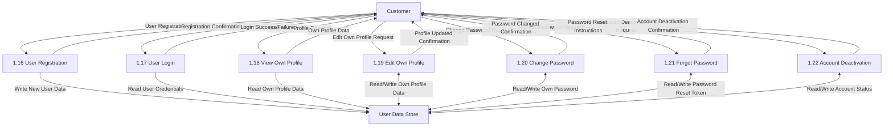

**Process Descriptions:**

- **1.16 User Registration**: Customer can create new account by providing required information and agreeing to terms of service.
- **1.17 User Login**: Customer can authenticate to access the system using username/email and password credentials.
- **1.18 View Own Profile**: Customer can view their profile information including personal details, order history, and account status.
- **1.19 Edit Own Profile**: Customer can update their profile information such as contact details, preferences, and billing information.
- **1.20 Change Password**: Customer can change their account password following security requirements and validation.
- **1.21 Forgot Password**: Customer can request password reset through email verification and security questions.
- **1.22 Account Deactivation**: Customer can request to deactivate their account while maintaining data for potential reactivation.

**Data Flows:**
- Admin has full read/write access to all user data with administrative privileges.
- Staff has limited access focused on customer support functions and own profile management.
- Customer has full control over own account data but cannot access other users' information.
- All password operations include security measures and encryption protocols.

### 2.1 Product Management - Medicine Management (Process 2.1)

This diagram details how Staff manages medicine information within the Product Management system, breaking down the medicine-specific operations.

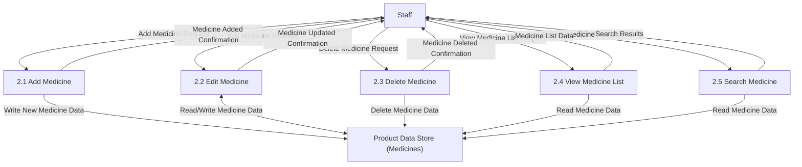

**Process Descriptions:**

- **2.1 Add Medicine**: Staff can add new medicine records with details like name, category, price, stock quantity, expiry date, and description.
- **2.2 Edit Medicine**: Staff can modify existing medicine information including updating stock levels, prices, and other details.
- **2.3 Delete Medicine**: Staff can remove medicine records from the system (typically for discontinued products).
- **2.4 View Medicine List**: Staff can retrieve and display all available medicines with filtering options.
- **2.5 Search Medicine**: Staff can search for specific medicines by name, category, or other criteria.

**Data Flows:**
- All processes interact with the Product Data Store (Medicines) to read or write medicine-related data.
- Staff receives confirmations for all modification operations and data results for query operations.

// ...existing code...

### 2.2 Product Management - Medicine Management by Admin (Process 2.2)

This diagram shows how Admin manages medicine information with extended privileges compared to Staff, including additional administrative functions.

```mermaid
graph TD
    Admin[Admin] -->|Add Medicine Request| P2_6["2.6 Add Medicine"]
    Admin -->|Edit Medicine Request| P2_7["2.7 Edit Medicine"]
    Admin -->|Delete Medicine Request| P2_8["2.8 Delete Medicine"]
    Admin -->|View Medicine List Request| P2_9["2.9 View Medicine List"]
    Admin -->|Search Medicine Request| P2_10["2.10 Search Medicine"]
    Admin -->|Bulk Import Medicine Request| P2_11["2.11 Bulk Import Medicine"]
    Admin -->|Generate Medicine Report Request| P2_12["2.12 Generate Medicine Report"]
    Admin -->|Manage Medicine Categories Request| P2_13["2.13 Manage Medicine Categories"]
    
    P2_6 -->|Medicine Added Confirmation| Admin
    P2_7 -->|Medicine Updated Confirmation| Admin
    P2_8 -->|Medicine Deleted Confirmation| Admin
    P2_9 -->|Medicine List Data| Admin
    P2_10 -->|Search Results| Admin
    P2_11 -->|Import Status Report| Admin
    P2_12 -->|Medicine Analytics Report| Admin
    P2_13 -->|Category Management Confirmation| Admin
    
    P2_6 -->|Write New Medicine Data| DS2_Med["Product Data Store (Medicines)"]
    P2_7 <-->|Read/Write Medicine Data| DS2_Med
    P2_8 -->|Delete Medicine Data| DS2_Med
    P2_9 -->|Read Medicine Data| DS2_Med
    P2_10 -->|Read Medicine Data| DS2_Med
    P2_11 -->|Write Bulk Medicine Data| DS2_Med
    P2_12 -->|Read Medicine Data| DS2_Med
    P2_13 <-->|Read/Write Category Data| DS2_Med
```

**Process Descriptions:**

- **2.6 Add Medicine**: Admin can add new medicine records with full access to all fields and settings.
- **2.7 Edit Medicine**: Admin can modify any medicine information with elevated privileges.
- **2.8 Delete Medicine**: Admin can remove medicine records with override capabilities.
- **2.9 View Medicine List**: Admin can access comprehensive medicine lists with advanced filtering.
- **2.10 Search Medicine**: Admin can perform advanced searches with administrative filters.
- **2.11 Bulk Import Medicine**: Admin can import multiple medicine records from external files.
- **2.12 Generate Medicine Report**: Admin can generate detailed analytics and reports on medicine data.
- **2.13 Manage Medicine Categories**: Admin can create, edit, and delete medicine categories.

### 2.3 Product Management - Customer Medicine Interaction (Process 2.3)

This diagram shows how Customers interact with medicine information for browsing and ordering purposes.

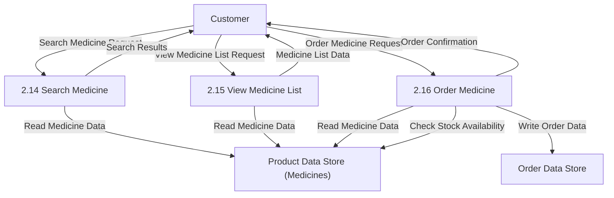

**Process Descriptions:**

- **2.14 Search Medicine**: Customer can search for medicines by name, category, symptoms, or other criteria with public access filters.
- **2.15 View Medicine List**: Customer can browse available medicines with basic information like name, price, and availability.
- **2.16 Order Medicine**: Customer can place orders for selected medicines, which creates order records and checks stock availability.

**Data Flows:**
- Customer processes only read medicine data for browsing and searching.
- Order process writes to Order Data Store and checks stock levels in Product Data Store.
- All customer interactions are read-only for medicine data, maintaining data security.

// ...existing code...

### 2.4 Product Management - Machine Management by Staff (Process 2.4)

This diagram details how Staff manages scientific machine information within the Product Management system.

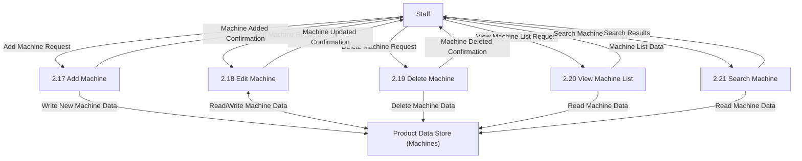

**Process Descriptions:**

- **2.17 Add Machine**: Staff can add new scientific machine records with details like name, model, specifications, price, availability, and technical documentation.
- **2.18 Edit Machine**: Staff can modify existing machine information including updating specifications, prices, availability status, and maintenance records.
- **2.19 Delete Machine**: Staff can remove machine records from the system (typically for discontinued models).
- **2.20 View Machine List**: Staff can retrieve and display all available machines with filtering options by category, price range, or specifications.
- **2.21 Search Machine**: Staff can search for specific machines by name, model, category, or technical specifications.

### 2.5 Product Management - Machine Management by Admin (Process 2.5)

This diagram shows how Admin manages machine information with extended privileges and additional administrative functions.

```mermaid
graph TD
    Admin[Admin] -->|Add Machine Request| P2_22["2.22 Add Machine"]
    Admin -->|Edit Machine Request| P2_23["2.23 Edit Machine"]
    Admin -->|Delete Machine Request| P2_24["2.24 Delete Machine"]
    Admin -->|View Machine List Request| P2_25["2.25 View Machine List"]
    Admin -->|Search Machine Request| P2_26["2.26 Search Machine"]
    Admin -->|Bulk Import Machine Request| P2_27["2.27 Bulk Import Machine"]
    Admin -->|Generate Machine Report Request| P2_28["2.28 Generate Machine Report"]
    Admin -->|Manage Machine Categories Request| P2_29["2.29 Manage Machine Categories"]
    Admin -->|Configure Machine Pricing Request| P2_30["2.30 Configure Machine Pricing"]
    
    P2_22 -->|Machine Added Confirmation| Admin
    P2_23 -->|Machine Updated Confirmation| Admin
    P2_24 -->|Machine Deleted Confirmation| Admin
    P2_25 -->|Machine List Data| Admin
    P2_26 -->|Search Results| Admin
    P2_27 -->|Import Status Report| Admin
    P2_28 -->|Machine Analytics Report| Admin
    P2_29 -->|Category Management Confirmation| Admin
    P2_30 -->|Pricing Configuration Confirmation| Admin
    
    P2_22 -->|Write New Machine Data| DS2_Mac["Product Data Store (Machines)"]
    P2_23 <-->|Read/Write Machine Data| DS2_Mac
    P2_24 -->|Delete Machine Data| DS2_Mac
    P2_25 -->|Read Machine Data| DS2_Mac
    P2_26 -->|Read Machine Data| DS2_Mac
    P2_27 -->|Write Bulk Machine Data| DS2_Mac
    P2_28 -->|Read Machine Data| DS2_Mac
    P2_29 <-->|Read/Write Category Data| DS2_Mac
    P2_30 <-->|Read/Write Pricing Data| DS2_Mac
```

**Process Descriptions:**

- **2.22 Add Machine**: Admin can add new machine records with full access to all fields and advanced settings.
- **2.23 Edit Machine**: Admin can modify any machine information with elevated privileges and access to restricted fields.
- **2.24 Delete Machine**: Admin can remove machine records with override capabilities and cascade deletion options.
- **2.25 View Machine List**: Admin can access comprehensive machine lists with advanced filtering and administrative views.
- **2.26 Search Machine**: Admin can perform advanced searches with administrative filters and hidden machine data.
- **2.27 Bulk Import Machine**: Admin can import multiple machine records from external files or databases.
- **2.28 Generate Machine Report**: Admin can generate detailed analytics and reports on machine inventory, sales, and performance.
- **2.29 Manage Machine Categories**: Admin can create, edit, and delete machine categories and subcategories.
- **2.30 Configure Machine Pricing**: Admin can set up complex pricing rules, discounts, and promotional offers for machines.

### 2.6 Product Management - Customer Machine Interaction (Process 2.6)

This diagram shows how Customers interact with machine information for browsing and ordering purposes.

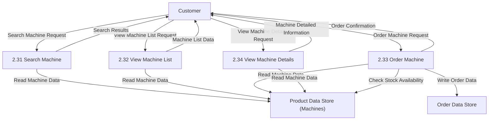

**Process Descriptions:**

- **2.31 Search Machine**: Customer can search for scientific machines by name, category, specifications, price range, or application purpose with public access filters.
- **2.32 View Machine List**: Customer can browse available machines with basic information like name, price, main specifications, and availability status.
- **2.33 Order Machine**: Customer can place orders for selected machines, which creates order records and checks stock availability for high-value scientific equipment.
- **2.34 View Machine Details**: Customer can access detailed machine information including technical specifications, user manuals, and application guides.

**Data Flows:**
- Customer processes only read machine data for browsing, searching, and viewing details.
- Order process writes to Order Data Store and checks stock levels in Product Data Store.
- All customer interactions with machine data are read-only, maintaining data security and preventing unauthorized modifications.

// ...existing code...

// ...existing code...

### 3.1 Online Purchase Management - Admin Purchase Management (Process 3.1)

This diagram shows how Admin manages the entire purchase process with full administrative control over orders, payments, and system configuration.

```mermaid
graph TD
    Admin[Admin] -->|View All Orders Request| P3_1["3.1 View All Orders"]
    Admin -->|Edit Order Request| P3_2["3.2 Edit Order"]
    Admin -->|Cancel Order Request| P3_3["3.3 Cancel Order"]
    Admin -->|Process Refund Request| P3_4["3.4 Process Refund"]
    Admin -->|Generate Sales Report Request| P3_5["3.5 Generate Sales Report"]
    Admin -->|Manage Payment Methods Request| P3_6["3.6 Manage Payment Methods"]
    Admin -->|Configure Pricing Request| P3_7["3.7 Configure Pricing"]
    Admin -->|Bulk Order Operations Request| P3_8["3.8 Bulk Order Operations"]
    
    P3_1 -->|All Orders List| Admin
    P3_2 -->|Order Updated Confirmation| Admin
    P3_3 -->|Order Cancelled Confirmation| Admin
    P3_4 -->|Refund Processed Confirmation| Admin
    P3_5 -->|Sales Analytics Report| Admin
    P3_6 -->|Payment Configuration Confirmation| Admin
    P3_7 -->|Pricing Updated Confirmation| Admin
    P3_8 -->|Bulk Operation Status| Admin
    
    P3_1 -->|Read Order Data| DS3["Order Data Store"]
    P3_2 <-->|Read/Write Order Data| DS3
    P3_3 <-->|Read/Write Order Status| DS3
    P3_4 <-->|Read/Write Payment Data| DS4["Payment Data Store"]
    P3_5 -->|Read Order/Payment Data| DS3
    P3_5 -->|Read Order/Payment Data| DS4
    P3_6 <-->|Read/Write Payment Config| DS4
    P3_7 <-->|Read/Write Product Pricing| DS2["Product Data Store"]
    P3_8 <-->|Read/Write Order Data| DS3
```

**Process Descriptions:**

- **3.1 View All Orders**: Admin can access comprehensive order lists with advanced filtering by status, date, customer, product type, and payment method.
- **3.2 Edit Order**: Admin can modify order details including quantities, products, shipping addresses, and special instructions with override capabilities.
- **3.3 Cancel Order**: Admin can cancel orders at any stage with full refund processing and inventory adjustment.
- **3.4 Process Refund**: Admin can handle refund requests, partial refunds, and complex payment reversals.
- **3.5 Generate Sales Report**: Admin can generate detailed sales analytics, revenue reports, and business intelligence data.
- **3.6 Manage Payment Methods**: Admin can configure payment gateways, add new payment options, and manage transaction settings.
- **3.7 Configure Pricing**: Admin can set up dynamic pricing rules, discounts, promotional offers, and bulk pricing structures.
- **3.8 Bulk Order Operations**: Admin can perform mass operations like order imports, status updates, and batch processing.

### 3.2 Online Purchase Management - Staff Order Processing (Process 3.2)

This diagram shows how Staff processes and manages orders as part of their operational responsibilities.

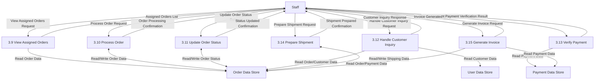

**Process Descriptions:**

- **3.9 View Assigned Orders**: Staff can view orders assigned to them with relevant details for processing and fulfillment.
- **3.10 Process Order**: Staff can move orders through the workflow stages from confirmation to fulfillment.
- **3.11 Update Order Status**: Staff can update order status (processing, shipped, delivered) and add tracking information.
- **3.12 Handle Customer Inquiry**: Staff can respond to customer questions about orders, shipping, and product information.
- **3.13 Verify Payment**: Staff can verify payment status, check transaction details, and resolve payment issues.
- **3.14 Prepare Shipment**: Staff can prepare orders for shipping, generate shipping labels, and coordinate with logistics.
- **3.15 Generate Invoice**: Staff can create invoices, receipts, and delivery documents for completed orders.

### 3.3 Online Purchase Management - Customer Purchase Process (Process 3.3)

This diagram shows how Customers place orders, make payments, and track their purchases through the system.

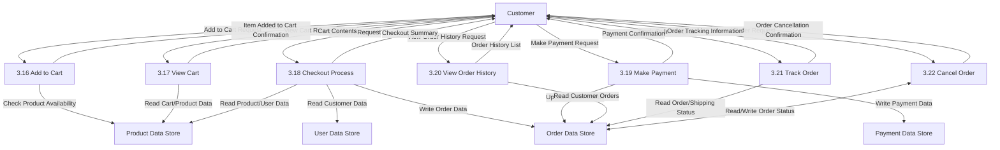

**Process Descriptions:**

- **3.16 Add to Cart**: Customer can add selected medicines/machines to their shopping cart with quantity selection and availability checking.
- **3.17 View Cart**: Customer can review cart contents, modify quantities, remove items, and see total pricing before checkout.
- **3.18 Checkout Process**: Customer can proceed through checkout by providing shipping information, selecting delivery options, and confirming order details.
- **3.19 Make Payment**: Customer can complete payment using various methods (credit card, bank transfer, digital wallet) with secure transaction processing.
- **3.20 View Order History**: Customer can access their complete order history with details, status, and reorder options.
- **3.21 Track Order**: Customer can track order status, shipping progress, and estimated delivery times for active orders.
- **3.22 Cancel Order**: Customer can cancel orders within allowed timeframes with automatic refund processing for eligible cancellations.

**Data Flows:**
- Admin has full access to all order data with comprehensive management and reporting capabilities.
- Staff has operational access focused on order processing, fulfillment, and customer support functions.
- Customer has access to their own orders and cart data with secure payment processing and order tracking.
- All payment operations include security measures, encryption, and fraud detection protocols.

// ...existing code...

### 4.1 Educational Activity Management - Admin Activity Management (Process 4.1)

This diagram shows how Admin manages educational activities with full administrative control over all aspects of educational programs.

```mermaid
graph TD
    Admin[Admin] -->|Create Activity Request| P4_1["4.1 Create Activity"]
    Admin -->|Edit Activity Request| P4_2["4.2 Edit Activity"]
    Admin -->|Delete Activity Request| P4_3["4.3 Delete Activity"]
    Admin -->|View All Activities Request| P4_4["4.4 View All Activities"]
    Admin -->|Manage Activity Categories Request| P4_5["4.5 Manage Activity Categories"]
    Admin -->|Assign Staff to Activity Request| P4_6["4.6 Assign Staff to Activity"]
    Admin -->|Generate Activity Report Request| P4_7["4.7 Generate Activity Report"]
    Admin -->|Bulk Activity Operations Request| P4_8["4.8 Bulk Activity Operations"]
    Admin -->|Configure Activity Settings Request| P4_9["4.9 Configure Activity Settings"]
    
    P4_1 -->|Activity Created Confirmation| Admin
    P4_2 -->|Activity Updated Confirmation| Admin
    P4_3 -->|Activity Deleted Confirmation| Admin
    P4_4 -->|All Activities List| Admin
    P4_5 -->|Category Management Confirmation| Admin
    P4_6 -->|Staff Assignment Confirmation| Admin
    P4_7 -->|Activity Analytics Report| Admin
    P4_8 -->|Bulk Operation Status| Admin
    P4_9 -->|Settings Updated Confirmation| Admin
    
    P4_1 -->|Write New Activity Data| DS5["Educational Activity Data Store"]
    P4_2 <-->|Read/Write Activity Data| DS5
    P4_3 -->|Delete Activity Data| DS5
    P4_4 -->|Read Activity Data| DS5
    P4_5 <-->|Read/Write Category Data| DS5
    P4_6 <-->|Read/Write Staff Assignment| DS5
    P4_6 -->|Read Staff Data| DS1["User Data Store"]
    P4_7 -->|Read Activity/Registration Data| DS5
    P4_8 <-->|Read/Write Activity Data| DS5
    P4_9 <-->|Read/Write Configuration Data| DS5
```

**Process Descriptions:**

- **4.1 Create Activity**: Admin can create new educational activities including workshops, seminars, training courses with full configuration options.
- **4.2 Edit Activity**: Admin can modify any activity details including schedule, content, capacity, prerequisites, and pricing.
- **4.3 Delete Activity**: Admin can remove activities with override capabilities and handle participant notifications.
- **4.4 View All Activities**: Admin can access comprehensive activity lists with advanced filtering and administrative views.
- **4.5 Manage Activity Categories**: Admin can create, edit, and organize activity categories and subcategories.
- **4.6 Assign Staff to Activity**: Admin can assign lecturers/instructors to activities and manage teaching schedules.
- **4.7 Generate Activity Report**: Admin can generate reports on activity performance, attendance, and educational effectiveness.
- **4.8 Bulk Activity Operations**: Admin can perform mass operations like importing activities, batch updates, and schedule management.
- **4.9 Configure Activity Settings**: Admin can set up system-wide educational policies, registration rules, and certification requirements.

### 4.2 Educational Activity Management - Staff Activity Organization (Process 4.2)

This diagram shows how Staff organizes and manages educational sessions as lecturers/instructors with operational control over their assigned activities.

```mermaid
graph TD
    Staff[Staff] -->|Organize Learning Session Request| P4_10["4.10 Organize Learning Session"]
    Staff -->|Manage Session List Request| P4_11["4.11 Manage Session List"]
    Staff -->|Update Session Content Request| P4_12["4.12 Update Session Content"]
    Staff -->|View Assigned Activities Request| P4_13["4.13 View Assigned Activities"]
    Staff -->|Manage Participant List Request| P4_14["4.14 Manage Participant List"]
    Staff -->|Record Attendance Request| P4_15["4.15 Record Attendance"]
    Staff -->|Upload Learning Materials Request| P4_16["4.16 Upload Learning Materials"]
    
    P4_10 -->|Session Organized Confirmation| Staff
    P4_11 -->|Session List Data| Staff
    P4_12 -->|Content Updated Confirmation| Staff
    P4_13 -->|Assigned Activities List| Staff
    P4_14 -->|Participant List Data| Staff
    P4_15 -->|Attendance Recorded Confirmation| Staff
    P4_16 -->|Materials Uploaded Confirmation| Staff
    
    P4_10 -->|Write Session Data| DS5["Educational Activity Data Store"]
    P4_11 -->|Read Session Data| DS5
    P4_12 <-->|Read/Write Content Data| DS5
    P4_13 -->|Read Assigned Activity Data| DS5
    P4_14 -->|Read Registration Data| DS5
    P4_15 <-->|Read/Write Attendance Data| DS5
    P4_16 -->|Write Learning Materials| DS5
```

**Process Descriptions:**

- **4.10 Organize Learning Session**: Staff can create and schedule individual learning sessions within their assigned activities including setting topics, duration, and requirements.
- **4.11 Manage Session List**: Staff can view, organize, and manage their complete list of scheduled sessions with calendar integration.
- **4.12 Update Session Content**: Staff can modify session content, add learning objectives, update materials, and adjust session plans.
- **4.13 View Assigned Activities**: Staff can see all educational activities they are assigned to teach with detailed information and schedules.
- **4.14 Manage Participant List**: Staff can view registered participants, manage waitlists, and communicate with learners.
- **4.15 Record Attendance**: Staff can mark attendance, track participation, and maintain learning progress records.
- **4.16 Upload Learning Materials**: Staff can upload presentations, documents, videos, and other educational resources for participants.

### 4.3 Educational Activity Management - Customer Activity Participation (Process 4.3)

This diagram shows how Customers search for, register, and participate in educational activities offered by the system.

```mermaid
graph TD
    Customer[Customer] -->|Search Activities Request| P4_17["4.17 Search Activities"]
    Customer -->|View Activity Details Request| P4_18["4.18 View Activity Details"]
    Customer -->|Register for Activity Request| P4_19["4.19 Register for Activity"]
    Customer -->|View Registered Activities Request| P4_20["4.20 View Registered Activities"]
    Customer -->|Cancel Registration Request| P4_21["4.21 Cancel Registration"]
    Customer -->|Download Learning Materials Request| P4_22["4.22 Download Learning Materials"]
    Customer -->|Provide Activity Feedback Request| P4_23["4.23 Provide Activity Feedback"]
    
    P4_17 -->|Search Results| Customer
    P4_18 -->|Activity Details| Customer
    P4_19 -->|Registration Confirmation| Customer
    P4_20 -->|Registered Activities List| Customer
    P4_21 -->|Cancellation Confirmation| Customer
    P4_22 -->|Learning Materials| Customer
    P4_23 -->|Feedback Submitted Confirmation| Customer
    
    P4_17 -->|Read Activity Data| DS5["Educational Activity Data Store"]
    P4_18 -->|Read Activity Details| DS5
    P4_19 -->|Write Registration Data| DS5
    P4_19 -->|Check Capacity/Prerequisites| DS5
    P4_20 -->|Read Customer Registrations| DS5
    P4_21 <-->|Read/Write Registration Status| DS5
    P4_22 -->|Read Learning Materials| DS5
    P4_23 -->|Write Feedback Data| DS5
```

**Process Descriptions:**

- **4.17 Search Activities**: Customer can search for educational activities by topic, date, level, instructor, location, or keywords with filtering options.
- **4.18 View Activity Details**: Customer can access detailed information about activities including description, schedule, prerequisites, instructor bio, and curriculum.
- **4.19 Register for Activity**: Customer can register for educational activities with prerequisite checking, capacity validation, and payment processing if required.
- **4.20 View Registered Activities**: Customer can see all their registered activities with schedules, status, and upcoming session information.
- **4.21 Cancel Registration**: Customer can cancel their registration within allowed timeframes with automatic refund processing if applicable.
- **4.22 Download Learning Materials**: Customer can access and download educational materials, handouts, and resources provided by instructors.
- **4.23 Provide Activity Feedback**: Customer can submit feedback and ratings about completed activities to help improve educational quality.

**Data Flows:**
- Admin has comprehensive control over all educational activities with full management and reporting capabilities.
- Staff has operational control over their assigned activities with focus on teaching, content management, and participant interaction.
- Customer has access to browse, register, and participate in educational activities with self-service capabilities.
- All registration processes include capacity checking, prerequisite validation, and automatic notification systems.

// ...existing code...

### 6.1 Customer Feedback Management - Customer Feedback Process (Process 6.1)

This diagram shows how Customers submit feedback about products, services, or educational activities and view responses from staff.

```mermaid
graph TD
    Customer[Customer] -->|Submit Feedback Request| P6_1["6.1 Submit Feedback"]
    Customer -->|View My Feedback Request| P6_2["6.2 View My Feedback"]
    Customer -->|View Feedback Response Request| P6_3["6.3 View Feedback Response"]
    Customer -->|Edit Feedback Request| P6_4["6.4 Edit Feedback"]
    Customer -->|Delete Feedback Request| P6_5["6.5 Delete Feedback"]
    
    P6_1 -->|Feedback Submitted Confirmation| Customer
    P6_2 -->|My Feedback List| Customer
    P6_3 -->|Feedback Response Data| Customer
    P6_4 -->|Feedback Updated Confirmation| Customer
    P6_5 -->|Feedback Deleted Confirmation| Customer
    
    P6_1 -->|Write Feedback Data| DS7["Feedback Data Store"]
    P6_1 -->|Read Customer Data| DS1["User Data Store"]
    P6_2 -->|Read Customer Feedback| DS7
    P6_3 -->|Read Feedback Response| DS7
    P6_4 <-->|Read/Write Feedback Data| DS7
    P6_5 -->|Delete Feedback Data| DS7
```

**Process Descriptions:**

- **6.1 Submit Feedback**: Customer can submit feedback about products (medicines/machines), services, educational activities, or general website experience with ratings and detailed comments.
- **6.2 View My Feedback**: Customer can view all their submitted feedback with current status (pending, responded, resolved).
- **6.3 View Feedback Response**: Customer can read responses from Admin/Staff to their feedback including follow-up questions or resolution details.
- **6.4 Edit Feedback**: Customer can modify their feedback within allowed timeframes before it's processed by staff.
- **6.5 Delete Feedback**: Customer can delete their own feedback if it hasn't been responded to yet.

### 6.2 Customer Feedback Management - Admin/Staff Feedback Processing (Process 6.2)

This diagram shows how Admin and Staff receive, process, and respond to customer feedback with shared responsibilities for feedback management.

```mermaid
graph TD
    AdminStaff["Admin/Staff"] -->|View All Feedback Request| P6_6["6.6 View All Feedback"]
    AdminStaff -->|View Pending Feedback Request| P6_7["6.7 View Pending Feedback"]
    AdminStaff -->|Respond to Feedback Request| P6_8["6.8 Respond to Feedback"]
    AdminStaff -->|Update Feedback Status Request| P6_9["6.9 Update Feedback Status"]
    AdminStaff -->|Search Feedback Request| P6_10["6.10 Search Feedback"]
    AdminStaff -->|Generate Feedback Report Request| P6_11["6.11 Generate Feedback Report"]
    AdminStaff -->|Assign Feedback Request| P6_12["6.12 Assign Feedback"]
    
    P6_6 -->|All Feedback List| AdminStaff
    P6_7 -->|Pending Feedback List| AdminStaff
    P6_8 -->|Response Sent Confirmation| AdminStaff
    P6_9 -->|Status Updated Confirmation| AdminStaff
    P6_10 -->|Feedback Search Results| AdminStaff
    P6_11 -->|Feedback Analytics Report| AdminStaff
    P6_12 -->|Assignment Confirmation| AdminStaff
    
    P6_6 -->|Read All Feedback Data| DS7["Feedback Data Store"]
    P6_7 -->|Read Pending Feedback| DS7
    P6_8 <-->|Read/Write Response Data| DS7
    P6_8 -->|Read Customer Data| DS1["User Data Store"]
    P6_9 <-->|Read/Write Feedback Status| DS7
    P6_10 -->|Read Feedback Data| DS7
    P6_11 -->|Read Feedback/Response Data| DS7
    P6_12 <-->|Read/Write Assignment Data| DS7
    P6_12 -->|Read Staff Data| DS1
```

**Process Descriptions:**

- **6.6 View All Feedback**: Admin/Staff can view comprehensive list of all customer feedback with filtering options by date, category, status, and priority.
- **6.7 View Pending Feedback**: Admin/Staff can see feedback that requires attention, responses, or follow-up actions with priority indicators.
- **6.8 Respond to Feedback**: Admin/Staff can provide detailed responses to customer feedback including solutions, explanations, or additional questions.
- **6.9 Update Feedback Status**: Admin/Staff can change feedback status (pending, in-progress, resolved, closed) and add internal notes.
- **6.10 Search Feedback**: Admin/Staff can search through feedback using various criteria like customer name, product, keywords, or feedback type.
- **6.11 Generate Feedback Report**: Admin/Staff can create reports on feedback trends, response times, customer satisfaction, and improvement areas.
- **6.12 Assign Feedback**: Admin/Staff can assign specific feedback to appropriate team members based on expertise or workload distribution.

### 6.3 Customer Feedback Management - Feedback Workflow Process (Process 6.3)

This diagram shows the overall workflow and notifications between customers and staff throughout the feedback lifecycle.

```mermaid
graph TD
    Customer[Customer] -->|Submit New Feedback| P6_13["6.13 Feedback Submission Workflow"]
    P6_13 -->|Feedback Received Notification| AdminStaff["Admin/Staff"]
    AdminStaff -->|Send Response| P6_14["6.14 Response Workflow"]
    P6_14 -->|Response Notification| Customer
    Customer -->|Follow-up Question| P6_15["6.15 Follow-up Workflow"]
    P6_15 -->|Follow-up Notification| AdminStaff
    AdminStaff -->|Close Feedback| P6_16["6.16 Closure Workflow"]
    P6_16 -->|Closure Notification| Customer
    
    P6_13 <-->|Read/Write Feedback Data| DS7["Feedback Data Store"]
    P6_14 <-->|Read/Write Response Data| DS7
    P6_15 <-->|Read/Write Follow-up Data| DS7
    P6_16 <-->|Read/Write Closure Data| DS7
    
    P6_13 -->|Send Email Notification| EmailSystem["Email Notification System"]
    P6_14 -->|Send Email Notification| EmailSystem
    P6_15 -->|Send Email Notification| EmailSystem
    P6_16 -->|Send Email Notification| EmailSystem
```

**Process Descriptions:**

- **6.13 Feedback Submission Workflow**: Manages the complete process when customer submits feedback including validation, categorization, and automatic notifications to relevant staff.
- **6.14 Response Workflow**: Handles the process when Admin/Staff responds to feedback including response validation, customer notification, and status updates.
- **6.15 Follow-up Workflow**: Manages additional communication between customer and staff for clarifications or additional information.
- **6.16 Closure Workflow**: Handles the process of closing feedback after resolution including final confirmation and satisfaction surveys.

**Data Flows:**
- Customer can submit, view, and manage their own feedback with real-time status updates.
- Admin/Staff have shared access to all feedback with collaborative response capabilities.
- Automatic notifications keep both parties informed throughout the feedback lifecycle.
- All feedback interactions are logged for quality assurance and performance tracking.

// ...existing code...

### 7.1 Report Generation - Admin/Staff Report Management (Process 7.1)

This diagram shows how Admin and Staff interact with the report generation system to view and manage various business and educational reports.

```mermaid
graph TD
    AdminStaff["Admin/Staff"] -->|Generate User Report Request| P7_1["7.1 Generate User Report"]
    AdminStaff -->|Generate Sales Report Request| P7_2["7.2 Generate Sales Report"]
    AdminStaff -->|Generate Product Report Request| P7_3["7.3 Generate Product Report"]
    AdminStaff -->|Generate Activity Report Request| P7_4["7.4 Generate Activity Report"]
    AdminStaff -->|Generate Feedback Report Request| P7_5["7.5 Generate Feedback Report"]
    AdminStaff -->|View Report List Request| P7_6["7.6 View Report List"]
    AdminStaff -->|View Report Details Request| P7_7["7.7 View Report Details"]
    AdminStaff -->|Delete Report Request| P7_8["7.8 Delete Report"]
    
    P7_1 -->|User Report Data| AdminStaff
    P7_2 -->|Sales Report Data| AdminStaff
    P7_3 -->|Product Report Data| AdminStaff
    P7_4 -->|Activity Report Data| AdminStaff
    P7_5 -->|Feedback Report Data| AdminStaff
    P7_6 -->|Report List| AdminStaff
    P7_7 -->|Report Details| AdminStaff
    P7_8 -->|Report Deleted Confirmation| AdminStaff
    
    P7_1 -->|Read User Data| DS1["User Data Store"]
    P7_1 -->|Write Report Data| DS8["Report Data Store"]
    P7_2 -->|Read Order/Payment Data| DS3["Order Data Store"]
    P7_2 -->|Read Payment Data| DS4["Payment Data Store"]
    P7_2 -->|Write Report Data| DS8
    P7_3 -->|Read Product Data| DS2["Product Data Store"]
    P7_3 -->|Write Report Data| DS8
    P7_4 -->|Read Activity Data| DS5["Educational Activity Data Store"]
    P7_4 -->|Write Report Data| DS8
    P7_5 -->|Read Feedback Data| DS7["Feedback Data Store"]
    P7_5 -->|Write Report Data| DS8
    P7_6 -->|Read Report Data| DS8
    P7_7 -->|Read Report Data| DS8
    P7_8 -->|Delete Report Data| DS8
```

**Process Descriptions:**

- **7.1 Generate User Report**: Admin/Staff can generate comprehensive reports on user registration trends, activity levels, user demographics, and account status summaries.
- **7.2 Generate Sales Report**: Admin/Staff can create detailed sales analytics including revenue trends, product performance, payment methods analysis, and customer purchasing patterns.
- **7.3 Generate Product Report**: Admin/Staff can generate reports on product inventory, stock levels, popular items, product categories performance, and supplier analytics.
- **7.4 Generate Activity Report**: Admin/Staff can create reports on educational activity effectiveness, attendance rates, participant feedback, and learning outcomes.
- **7.5 Generate Feedback Report**: Admin/Staff can generate customer satisfaction reports, feedback trends, response times, and service quality metrics.
- **7.6 View Report List**: Admin/Staff can browse all generated reports with filtering options by type, date range, creator, and status.
- **7.7 View Report Details**: Admin/Staff can access detailed report content including charts, graphs, data tables, and export options (PDF, Excel, CSV).
- **7.8 Delete Report**: Admin/Staff can remove outdated or unnecessary reports from the system to manage storage and maintain relevant data.

### 7.2 Report Generation - Report Processing Workflow (Process 7.2)

This diagram shows the internal workflow of report generation, data aggregation, and report storage processes.

```mermaid
graph TD
    AdminStaff["Admin/Staff"] -->|Report Generation Request| P7_9["7.9 Process Report Request"]
    P7_9 -->|Data Collection Request| P7_10["7.10 Collect Data from Sources"]
    P7_10 -->|Data Processing Request| P7_11["7.11 Process and Analyze Data"]
    P7_11 -->|Report Formatting Request| P7_12["7.12 Format Report"]
    P7_12 -->|Report Storage Request| P7_13["7.13 Store Report"]
    P7_13 -->|Report Ready Notification| AdminStaff
    
    P7_9 -->|Read Report Template| DS8["Report Data Store"]
    P7_10 -->|Read User Data| DS1["User Data Store"]
    P7_10 -->|Read Product Data| DS2["Product Data Store"]
    P7_10 -->|Read Order Data| DS3["Order Data Store"]
    P7_10 -->|Read Payment Data| DS4["Payment Data Store"]
    P7_10 -->|Read Activity Data| DS5["Educational Activity Data Store"]
    P7_10 -->|Read Feedback Data| DS7["Feedback Data Store"]
    P7_11 -->|Write Processed Data| DS8
    P7_12 -->|Write Formatted Report| DS8
    P7_13 -->|Write Final Report| DS8
```

**Process Descriptions:**

- **7.9 Process Report Request**: System validates report request, checks user permissions, and initiates report generation workflow with specified parameters.
- **7.10 Collect Data from Sources**: System gathers required data from multiple data stores based on report type and date range specifications.
- **7.11 Process and Analyze Data**: System performs calculations, aggregations, statistical analysis, and data transformations to generate meaningful insights.
- **7.12 Format Report**: System applies formatting, creates visualizations (charts, graphs), and structures data according to report template requirements.
- **7.13 Store Report**: System saves the completed report with metadata, access permissions, and automatic backup for future retrieval.

### 7.3 Report Generation - Report Access Control (Process 7.3)

This diagram shows the access control and permission management for report viewing and deletion operations.

```mermaid
graph TD
    AdminStaff["Admin/Staff"] -->|Access Report Request| P7_14["7.14 Validate Access Permissions"]
    P7_14 -->|Permission Granted| P7_15["7.15 Provide Report Access"]
    P7_14 -->|Permission Denied| P7_16["7.16 Access Denied Response"]
    P7_15 -->|Report Data/Deletion Confirmation| AdminStaff
    P7_16 -->|Access Denied Message| AdminStaff
    
    AdminStaff -->|Delete Report Request| P7_17["7.17 Validate Delete Permissions"]
    P7_17 -->|Delete Authorized| P7_18["7.18 Execute Report Deletion"]
    P7_17 -->|Delete Denied| P7_19["7.19 Deletion Denied Response"]
    P7_18 -->|Deletion Successful| AdminStaff
    P7_19 -->|Deletion Denied Message| AdminStaff
    
    P7_14 -->|Read User Permissions| DS1["User Data Store"]
    P7_14 -->|Read Report Metadata| DS8["Report Data Store"]
    P7_15 -->|Read Report Content| DS8
    P7_17 -->|Read User Permissions| DS1
    P7_17 -->|Read Report Metadata| DS8
    P7_18 -->|Delete Report Data| DS8
```

**Process Descriptions:**

- **7.14 Validate Access Permissions**: System checks if the requesting Admin/Staff has appropriate permissions to view specific report types or confidential data.
- **7.15 Provide Report Access**: System grants access to report content with appropriate security measures and audit logging.
- **7.16 Access Denied Response**: System provides clear feedback when access is denied due to insufficient permissions or security restrictions.
- **7.17 Validate Delete Permissions**: System verifies if the requesting user has authorization to delete reports, considering report importance and retention policies.
- **7.18 Execute Report Deletion**: System performs secure deletion with backup retention according to business rules and compliance requirements.
- **7.19 Deletion Denied Response**: System explains why deletion request was denied and suggests alternative actions if applicable.

**Data Flows:**
- Admin/Staff can generate various types of reports by accessing data from multiple system data stores.
- All report operations include proper access control and permission validation.
- Generated reports are stored securely with metadata for future retrieval and management.
- Report deletion includes safety checks and audit trails to prevent accidental loss of important business intelligence.