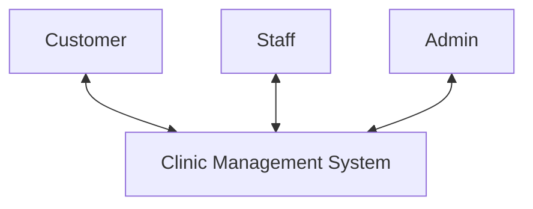
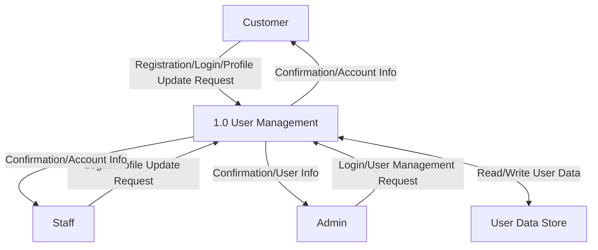
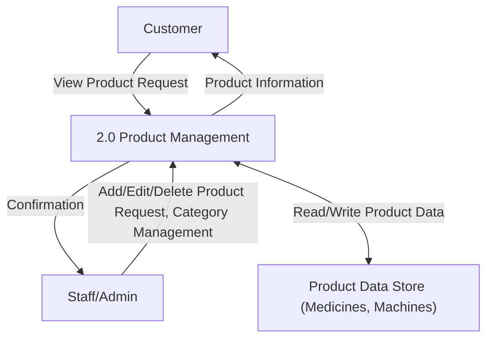
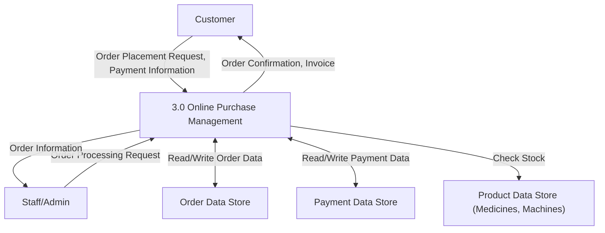
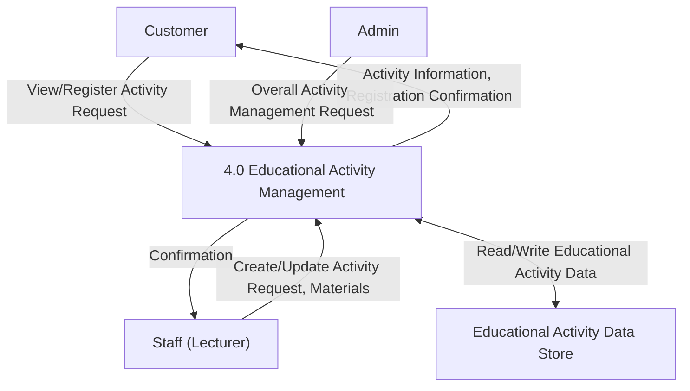
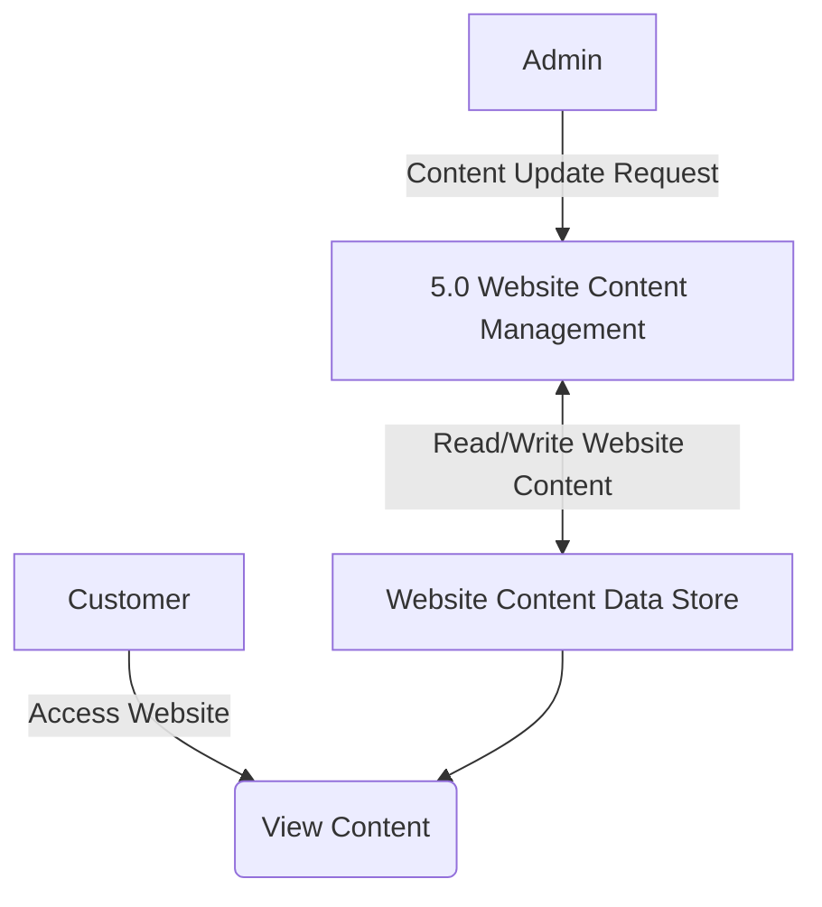
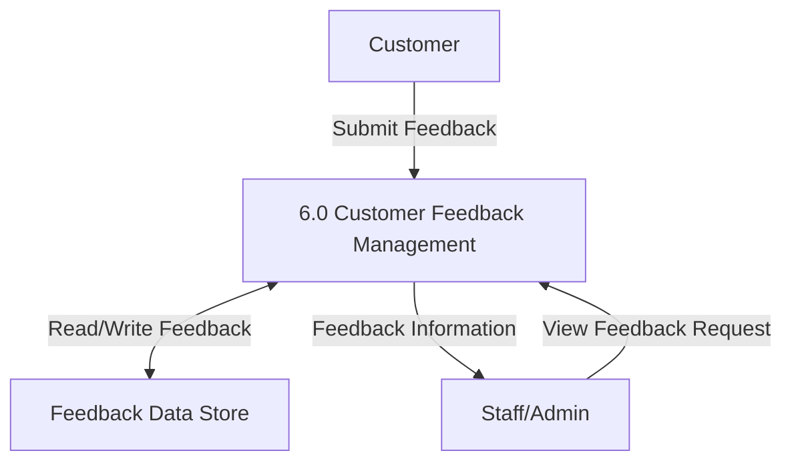
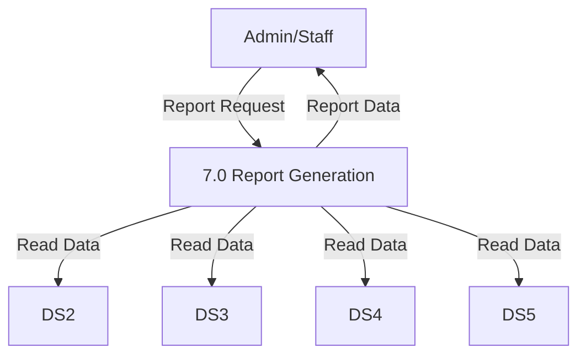

# Data Flow Diagram (DFD)

## Context Diagram (DFD Level 0)

## Level 1 DFD

Each item below represents a main process in DFD Level 1. More detailed sub-processes and their specific interactions with Data Stores will be described in DFD Level 2.

### 1. User Management (Process 1.0)
This process handles all activities related to user accounts (Customer, Staff, Admin) such as registration, login, personal information management, and authorization.

### 2. Product Management (Medicines and Scientific Machines) (Process 2.0)
This process includes displaying product information to Customers and allowing Staff/Admin to manage categories and detailed information of medicines and scientific machines.

### 3. Online Purchase Management (Process 3.0)
This process handles the entire purchasing process from Customer browsing, selecting products, placing orders, payment processing, to Staff/Admin processing the order.

### 4. Educational Activity Management (Process 4.0)
This process allows Customers to view and register for educational activities. Staff (Lecturers) can create and update content and schedules. Admin manages these activities overall.

### 5. Website Content Management (Process 5.0)
This process allows Admin to update static website content such as the homepage, about us, and contact information. The system will display this content to Customers.

*(Note: Customer viewing content is often an implicit query. DFDs focus on data flows initiated by users or explicitly processed by the system. Here, Admin updates the Data Store, and Customers will read from it via page requests.)*

### 6. Customer Feedback Management (Process 6.0)
This process allows Customers to submit feedback on products and services. Staff or Admin can view and process this feedback.

### 7. Report Generation (Process 7.0)
This process allows Admin or Staff to request and view summary reports on business performance and educational activity effectiveness, based on data from relevant Data Stores.

