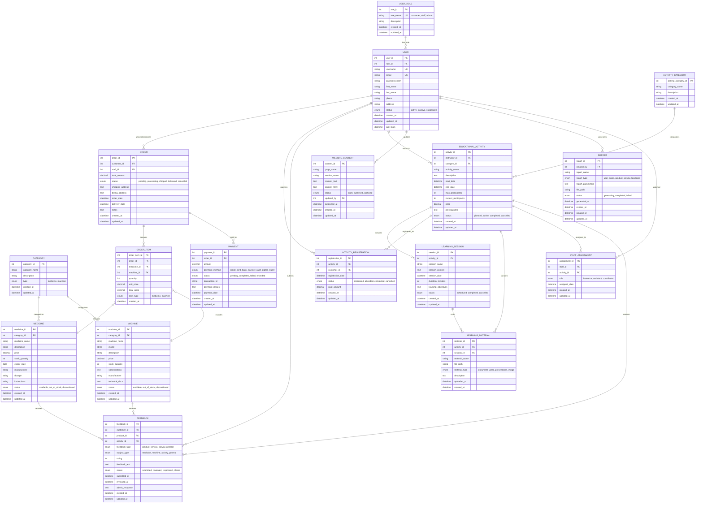

# Entity Relationship Diagram (ERD) - Clinic Management System

## ERD Diagram

## Entity Descriptions

### Core Entities

1. **USER_ROLE**: Defines user roles (Customer, Staff, Admin) with descriptions
2. **USER**: Represents all system users with role-based access control through USER_ROLE
3. **CATEGORY**: Product categories for both medicines and machines
4. **MEDICINE**: Pharmaceutical products with detailed medical information
5. **MACHINE**: Scientific equipment with technical specifications
6. **ORDER**: Customer purchase orders with status tracking
7. **ORDER_ITEM**: Individual items within orders (medicines or machines)
8. **PAYMENT**: Payment transactions linked to orders

### Educational System Entities

9. **EDUCATIONAL_ACTIVITY**: Training courses, workshops, seminars
10. **ACTIVITY_CATEGORY**: Categories for educational activities
11. **LEARNING_SESSION**: Individual sessions within activities
12. **ACTIVITY_REGISTRATION**: Customer enrollments in activities
13. **LEARNING_MATERIAL**: Educational resources and materials
14. **STAFF_ASSIGNMENT**: Staff assignments to educational activities

### Management Entities

15. **FEEDBACK**: Customer feedback on products and services
16. **WEBSITE_CONTENT**: CMS for website content management
17. **REPORT**: System-generated business and educational reports

## Key Relationships

- **UserRole-User**: One-to-many (each role can have multiple users, each user has one role)
- **User-Order**: One-to-many (customers place multiple orders, staff process orders)
- **Order-OrderItem**: One-to-many (each order contains multiple items)
- **Product-OrderItem**: Many-to-many through OrderItem (products can be in multiple orders)
- **User-ActivityRegistration**: One-to-many (customers register for multiple activities)
- **Activity-Session**: One-to-many (activities have multiple sessions)
- **Activity-StaffAssignment**: Many-to-many (activities can have multiple staff, staff can teach multiple activities)
- **Product-Feedback**: One-to-many (products receive multiple feedback)
- **User-Feedback**: One-to-many (users can submit multiple feedback)

## Business Rules Implemented

1. **Role-based Access**: User roles are now normalized in a separate table for better data integrity
2. **Product Management**: Separate entities for medicines and machines with shared categorization
3. **Order Processing**: Complete order lifecycle from placement to delivery
4. **Educational Activities**: Full learning management with sessions, materials, and registrations
5. **Feedback System**: Comprehensive feedback collection for products and activities
6. **Content Management**: Admin control over website content
7. **Reporting**: Data-driven reports for business intelligence