# Core Data Flow Diagram (DFD)

## Context Diagram (DFD Level 0)
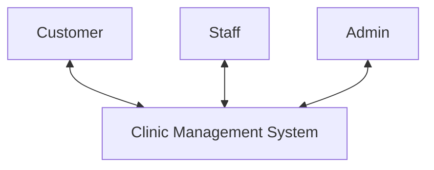

## Level 1 DFD

Each item below represents a main process in DFD Level 1 for the minimal project core functionality.

### 1. User Management (Process 1.0)
This process handles all activities related to user accounts (Customer, Staff, Admin) such as registration, login, personal information management, and authorization.

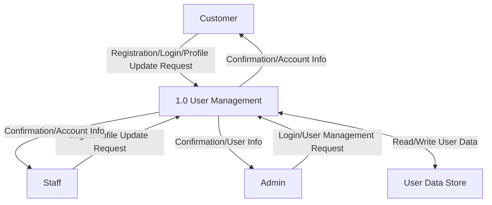

### 2. Product Management (Medicines and Scientific Machines) (Process 2.0)
This process includes displaying product information to Customers and allowing Staff/Admin to manage categories and detailed information of medicines and scientific machines.

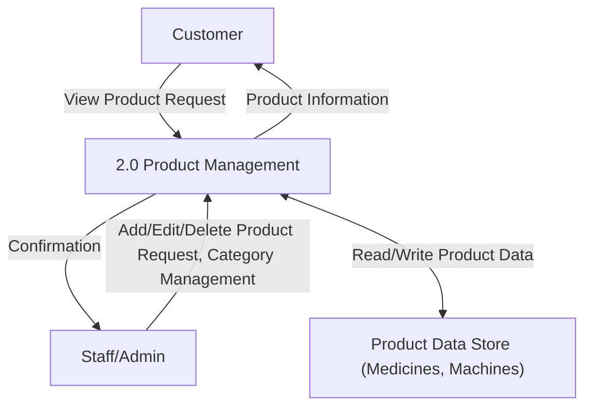

### 3. Online Purchase Management (Process 3.0)
This process handles the entire purchasing process from Customer browsing, selecting products, placing orders, payment processing, to Staff/Admin processing the order.

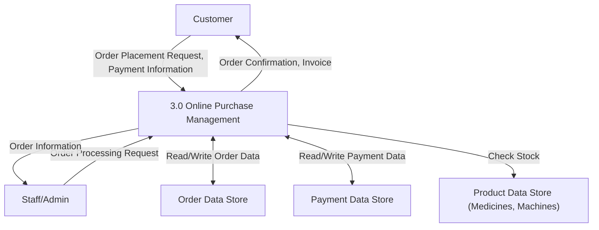

### 4. Report Generation (Process 7.0)
This process allows Admin or Staff to request and view summary reports on business performance based on data from relevant Data Stores.

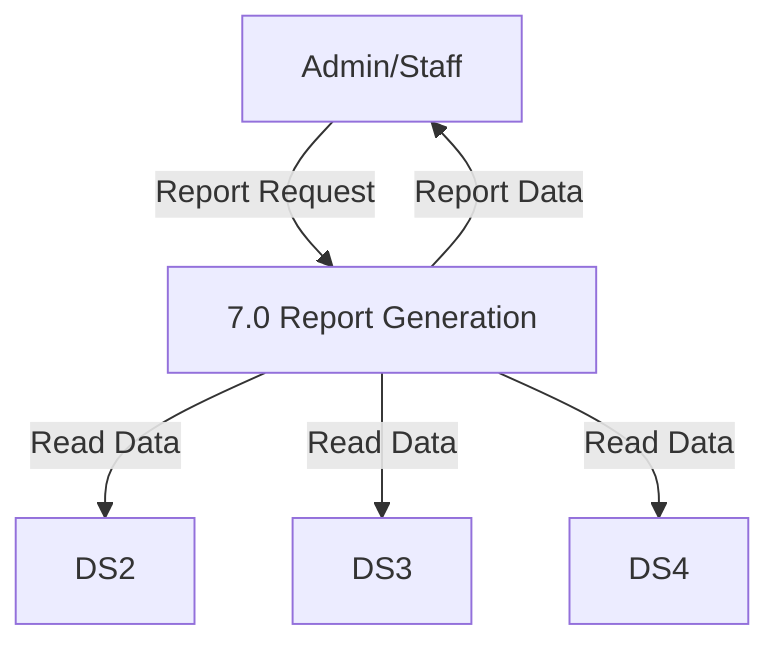

## Level 2 DFD for Core Functionality

### 1.1 User Management - Admin User Management (Process 1.1)

This diagram shows how Admin manages user accounts with full administrative privileges including creating, modifying, and managing all user types.

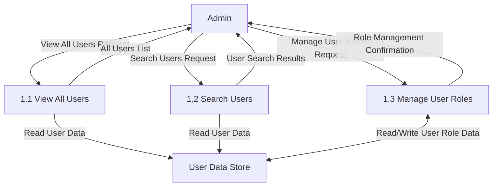

### 1.2 User Management - Staff User Management (Process 1.2)

This diagram shows how Staff manages limited user account functions, primarily for customer support and basic user assistance.

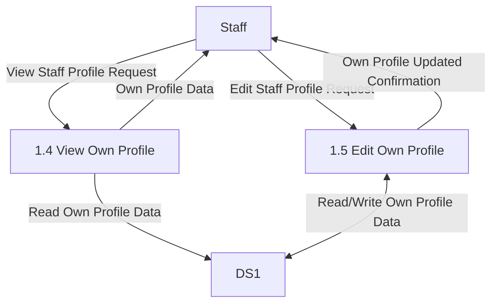

### 1.3 User Management - Customer Self-Management (Process 1.3)

This diagram shows how Customers manage their own accounts including registration, profile updates, and account settings.

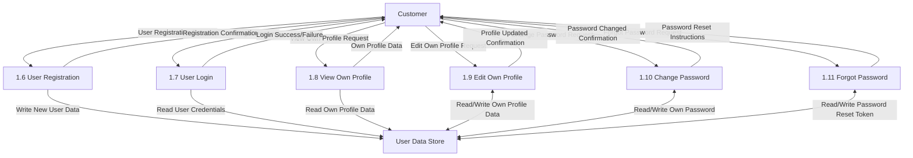

### 2.1 Product Management - Medicine Management (Process 2.1)

This diagram details how Staff manages medicine information within the Product Management system.

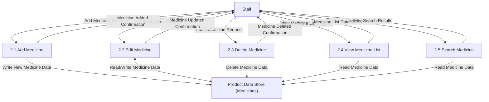

### 3.1 Online Purchase Management - Admin Purchase Management (Process 3.1)

This diagram shows how Admin manages the entire purchase process with full administrative control over orders, payments, and system configuration.

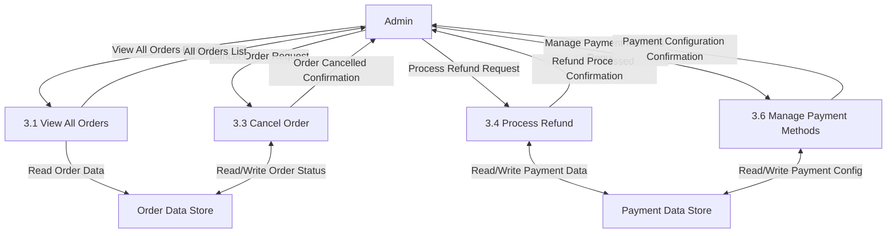

### 7.1 Report Generation - Admin/Staff Report Management (Process 7.1)

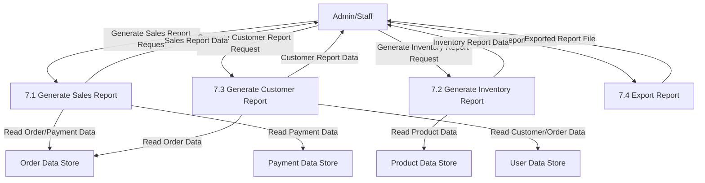

**Process Descriptions:**

- **7.1 Generate Sales Report**: Admin/Staff can create sales reports with filters for date ranges, product categories, payment methods, and sales channels.
- **7.2 Generate Inventory Report**: Admin/Staff can generate inventory status reports showing stock levels, product movement, low stock alerts, and valuation.
- **7.3 Generate Customer Report**: Admin/Staff can create customer analytics reports with purchasing patterns, demographics, and customer value metrics.
- **7.4 Export Report**: Admin/Staff can export any generated report to various formats (PDF, Excel, CSV) for sharing or archiving.
