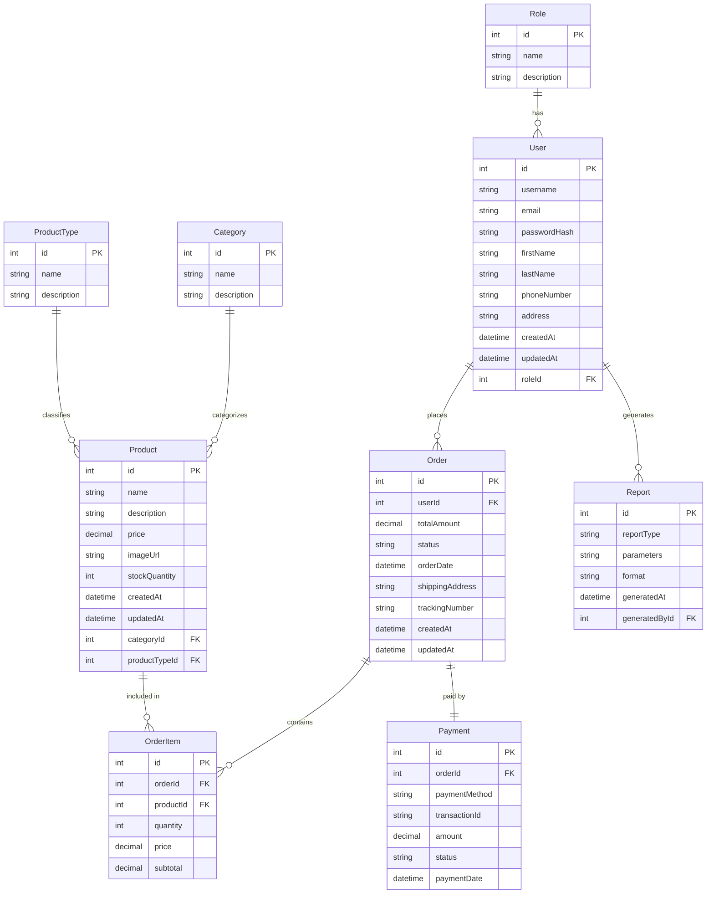

# Core Entity Relationship Diagram (ERD)

## Core Database Schema Design

## Core Entity Descriptions

### User
Represents all users of the system including customers, staff members, and administrators.
- **id**: Unique identifier for each user
- **username**: Unique login name
- **email**: User's email address (unique)
- **passwordHash**: Hashed password for security
- **firstName, lastName**: User's personal details
- **phoneNumber, address**: Contact information
- **createdAt, updatedAt**: Timestamps for record management
- **roleId**: Foreign key to Role entity

### Role
Defines user roles for authorization and permission management.
- **id**: Unique identifier for each role
- **name**: Role name (e.g., "Customer", "Staff", "Admin")
- **description**: Role description and purpose

### Product
Stores information about all available products (medicines and scientific machines).
- **id**: Unique identifier for each product
- **name**: Product name
- **description**: Detailed product description
- **price**: Product price
- **imageUrl**: URL to product image
- **stockQuantity**: Available inventory quantity
- **createdAt, updatedAt**: Timestamps for record management
- **categoryId**: Foreign key to Category entity
- **productTypeId**: Foreign key to ProductType entity (Medicine/Machine)

### ProductType
Classifies products as either medicines or scientific machines.
- **id**: Unique identifier for each product type
- **name**: Type name (e.g., "Medicine", "Scientific Machine")
- **description**: Type description

### Category
Organizes products into hierarchical categories.
- **id**: Unique identifier for each category
- **name**: Category name
- **description**: Category description

### Order
Represents customer orders with order metadata.
- **id**: Unique identifier for each order
- **userId**: Foreign key to User entity (customer who placed order)
- **totalAmount**: Total order amount
- **status**: Order status (e.g., "Processing", "Shipped", "Delivered")
- **orderDate**: Date and time when order was placed
- **shippingAddress**: Delivery address
- **trackingNumber**: Shipping tracking number
- **createdAt, updatedAt**: Timestamps for record management

### OrderItem
Represents individual line items within an order.
- **id**: Unique identifier for each order item
- **orderId**: Foreign key to Order entity
- **productId**: Foreign key to Product entity
- **quantity**: Quantity of product ordered
- **price**: Price at time of purchase
- **subtotal**: Price × Quantity

### Payment
Tracks payment information for orders.
- **id**: Unique identifier for each payment record
- **orderId**: Foreign key to Order entity
- **paymentMethod**: Method of payment (e.g., "Credit Card", "Bank Transfer")
- **transactionId**: External payment processor transaction ID
- **amount**: Payment amount
- **status**: Payment status (e.g., "Pending", "Completed", "Failed")
- **paymentDate**: Date and time of payment

### Report
Stores information about generated reports.
- **id**: Unique identifier for each report
- **reportType**: Type of report (e.g., "Sales", "Inventory", "Customer")
- **parameters**: JSON string of parameters used to generate report
- **format**: Report format (e.g., "PDF", "Excel")
- **generatedAt**: Date and time report was generated
- **generatedById**: Foreign key to User entity (who generated the report)

## Relationships

1. A User has one Role (many-to-one)
2. A User can place many Orders (one-to-many)
3. An Order contains many OrderItems (one-to-many)
4. A Product can be included in many OrderItems (one-to-many)
5. An Order has one Payment record (one-to-one)
6. A Category can have many Products (one-to-many)
7. A ProductType can classify many Products (one-to-many)
8. A User can generate many Reports (one-to-many)
