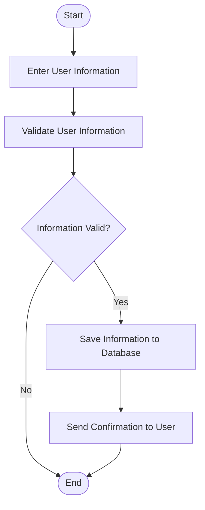
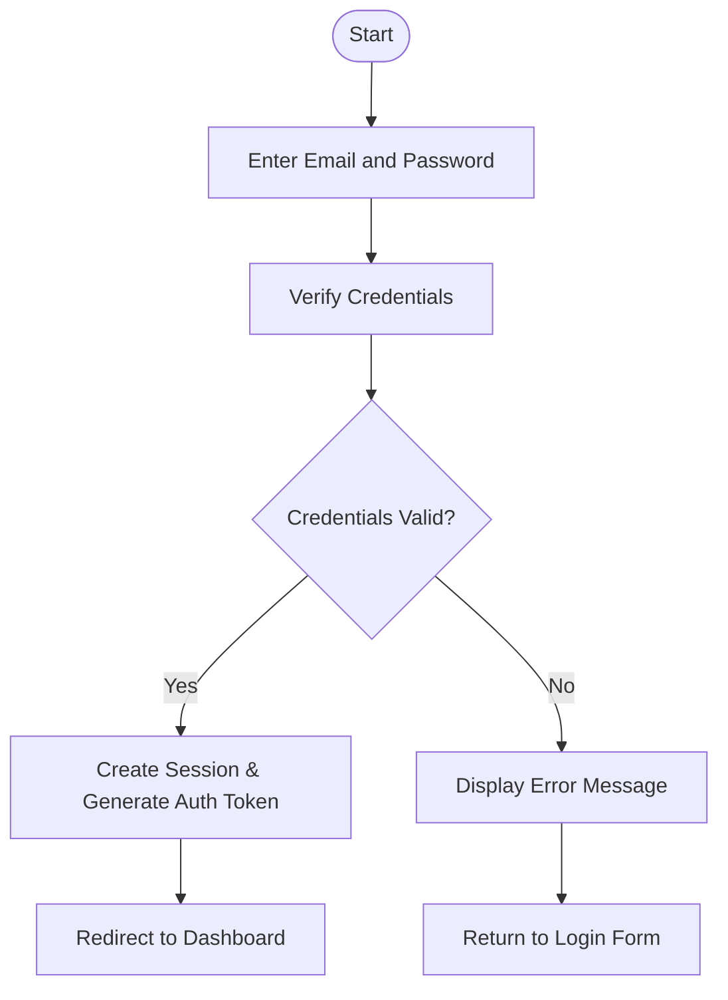
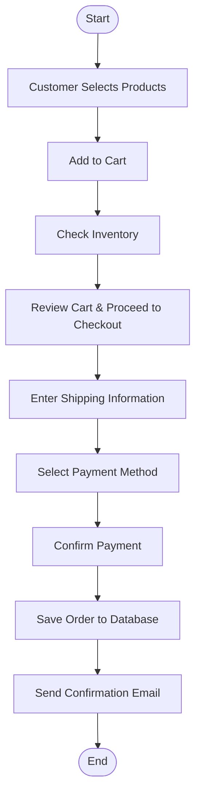

# Flowcharts - Core Process Flows

## 1. User Management Process



## 1A. Login Process



## 2. Product Management Process

```mermaid
flowchart TD
    Start([Start]) --> SelectProductType[Select Product Type\n(Medicine/Equipment)]
    SelectProductType --> EnterDetails[Enter Product Details]
    EnterDetails --> IsValid{Information Valid?}
    IsValid -->|Yes| SaveProduct[Save Product to Database]
    IsValid -->|No| End([End])
    SaveProduct --> UpdateCatalog[Update Product Catalog]
    UpdateCatalog --> End
```

## 3. Online Purchase Management Process



## 4. Report Generation Process

```mermaid
flowchart TD
    Start([Start]) --> SelectReportType[Select Report Type]
    SelectReportType --> SelectTimePeriod[Select Time Period]
    SelectTimePeriod --> AnalyzeData[Analyze Data from Database]
    AnalyzeData --> DisplayReport[Display Report]
    DisplayReport --> ExportReport[Export Report\n(Excel/PDF)]
    ExportReport --> End([End])
```
